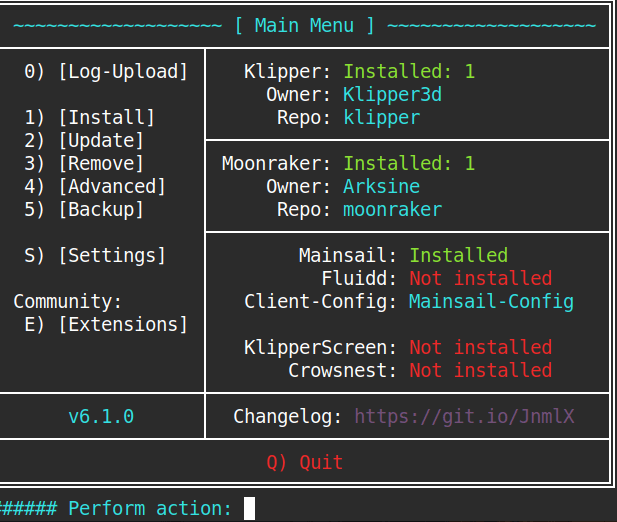
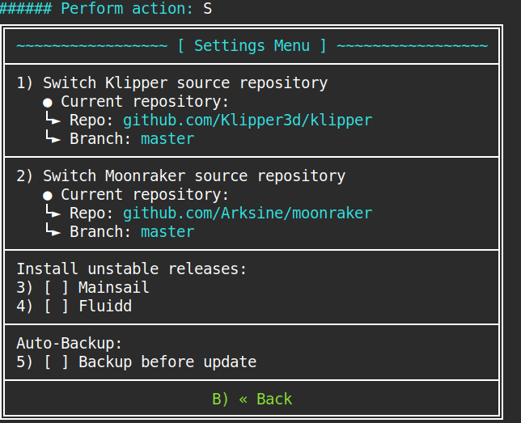
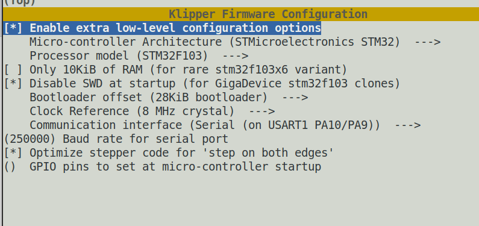

### 사용 환경

나는 라즈베리파이 4B에 Ubuntu Server OS를 올려 사용 중이며, 프린터 기종은 Ender-3 V3 SE이다.

다른 글들을 찾아보면 Raspberry Pi OS를 설치하고 Raspberry Pi Imager를 통해 Klipper 환경을 구성하는 경우가 많은 것 같은데, 나는 Ubuntu Server를 사용하고 있다. 라즈베리파이에 Ubuntu Server를 올려두면 현재 운영 중인 VPN같은 다른 서버 프로그램도 함께 관리하기 편하기 때문이다.

Ubuntu Server에 직접 설치하면 설정해야 할 부분이 조금 더 많다. 하지만 이런 과정을 직접 해보는 것도 리눅스에 대한 이해를 높이는 데 도움이 된다고 생각하기 때문에 관심이 있다면 시도해보는 것을 추천한다.

> [!NOTE]
> 이 글은 다음 내용을 전제로 설명한다.
>
> - SSH 접속이 가능한 상태
> - 리눅스 기본 명령어에 익숙함
> - 약간의 서버 관련 지식

3D 프린터 펌웨어는 크게 Marlin과 Klipper가 있다. Marlin은 주로 프린터 메인보드에서 연산과 제어를 처리하는 방식이고, Klipper는 별도의 서버에서 연산을 처리하고 프린터의 MCU가 실제 하드웨어 제어를 담당하는 구조라고 이해하면 편하다.

일단 나는 웹 인터페이스를 통한 파일 업로드와 원격 제어가 편리하다는 점 때문에 Klipper를 선택했다.

## Table of contents

## 1. KIAUH 설치 및 필수 소프트웨어 설치

KIAUH는 Klipper와 관련 프로그램을 쉽게 설치하고 관리할 수 있게 해주는 도구다.

먼저 SSH로 Ubuntu Server에 접속한 뒤 KIAUH를 설치할 것이다.

KIAUH를 통해 Klipper를 기본 설정으로 설치하면 사용자 홈 디렉토리에 관련 디렉토리들이 생성된다. 기존에 사용하던 홈 디렉토리와 Klipper 관련 파일을 분리해서 관리하고 싶었기 때문에, 나는 아예 `klipper`라는 별도의 사용자 계정을 만들어 관리하였다.

### Klipper 사용자 추가

먼저 `klipper`라는 이름의 사용자를 추가한다.

```bash
sudo adduser klipper
```

이후 해당 사용자에게 `sudo` 권한과 시리얼 장치 접근에 필요한 `dialout` 그룹 권한을 부여한다.

```bash
sudo usermod -aG sudo,dialout klipper
```

사용자 생성이 끝났다면 다음 명령어로 계정을 전환한다.

```bash
su - klipper
```

또는 SSH로 `klipper` 사용자 계정에 직접 로그인해도 된다.

### KIAUH 설치

Git으로 KIAUH Repository를 내려받는다.

```bash
git clone https://github.com/dw-0/kiauh.git
cd kiauh
```

Ender-3 V3 SE를 사용한다면 KIAUH에서 Klipper를 설치하기 전에 한 가지 설정을 추가해주는 것이 좋다.

KIAUH 디렉토리 내부에 `klipper_repos.txt` 파일을 만들고 다음 Repository를 추가한다.

```text
https://github.com/0xD34D/klipper_ender3_v3_se
```
이후 KIAUH를 실행한다.

```bash
./kiauh.sh
```

그러면 아래와 같은 화면이 나타난다.



우리가 설치해야 할 프로그램은 다음 3개다.

- Klipper
- Moonraker
- Mainsail

> [!IMPORTANT]
> 바로 설치하지 말고 먼저 **Settings**로 들어가 Klipper Source Repository를 변경하자.



Settings에서 Current Repository를 다음 Repository로 변경한다.

```text
https://github.com/0xD34D/klipper_ender3_v3_se
```

변경이 끝났다면 Install 메뉴로 돌아가 다음 순서대로 설치한다.

1. Klipper
2. Moonraker
3. Mainsail

설치 과정에서 `printer.cfg` 파일을 생성할지 물어보면 `Y`를 선택한다.

포트 설정은 기본값을 사용해도 된다. 다만 나처럼 기존 서버에서 이미 80번 포트를 사용하고 있다면 다른 포트로 변경해야 한다. 포트를 변경했다면 Ubuntu의 방화벽에서도 해당 포트를 열어주자. 나머지 설치 옵션은 화면의 설명을 읽어보면서 진행하면 된다.


## 2. 펌웨어 업로드

Klipper 설치가 끝났다면 이번에는 Ender-3 V3 SE 메인보드에 Klipper 펌웨어를 올려줘야 한다. 나는 프린터 구입 시 함께 들어 있던 8GB SD 카드를 사용했다.

Klipper를 설치했다면 `klipper` 사용자의 홈 디렉토리에 `klipper`라는 디렉토리가 생성되어 있을 것이다. 해당 디렉토리로 이동한 이후 다음 명령어를 실행한다.

```bash
make menuconfig
```

그러면 MCU 종류와 프린터에 맞게 펌웨어를 설정할 수 있는 화면이 나타난다.



### MCU 설정

Ender-3 V3 SE에는 다음 두 종류의 MCU가 사용되는 것으로 알려져 있다.

- `STM32F103`
- `GD32F303`

자신의 프린터에 어떤 MCU가 들어 있는지 확인하려면 프린터의 메인보드를 열어 MCU 칩에 적힌 모델명을 직접 확인하는 것이 가장 확실하다.

#### STM32F103인 경우

`Enable extra low-level configuration options`를 활성화하지 않고 설정하면 된다.

#### GD32F303인 경우

`Enable extra low-level configuration options`를 활성화한 뒤 아래에 나타나는 `Disable SWD at startup` 옵션도 활성화한다.

GD32F303은 STM32F103의 클론이기 때문에 Micro-controller랑 Processor Model은 STM32F103에 맞춰 선택하면 된다. 설정이 모두 끝났다면 `q`를 누르고 저장한다.

### 펌웨어 빌드

설정을 저장한 뒤 다음 명령어를 실행한다.

```bash
make
```

정상적으로 빌드가 완료되면 `~/klipper/out/klipper.bin`에 펌웨어 파일이 생성된다.

### SD 카드에 펌웨어 복사

SD 카드를 카드 리더기에 넣고 라즈베리파이에 연결한다.

먼저 다음 명령어로 연결된 저장장치를 확인한다.

```bash
lsblk
```

내 환경에서는 `sda` 아래의 `sda1`으로 SD 카드가 인식되었다.
SD 카드를 `/mnt`에 마운트한다.

```bash
sudo mount /dev/sda1 /mnt
```

이후 빌드한 펌웨어를 SD 카드로 복사한다.

```bash
sudo cp ~/klipper/out/klipper.bin /mnt/1234.bin
```

파일명은 반드시 `1234.bin`일 필요는 없다. 다만 이전에 업로드했던 펌웨어와 동일한 파일명을 다시 사용하면 제대로 업데이트되지 않을 수 있다는 이야기가 있어, 나는 이전과 다른 이름으로 변경해서 사용했다.

복사가 끝났다면 SD 카드를 언마운트한다.

```bash
sudo umount /mnt
```

이제 SD 카드를 라즈베리파이에서 분리한다.

### 프린터에 펌웨어 업로드

다음 순서대로 진행한다.

1. 프린터의 전원을 끈다.
2. 프린터에 연결된 USB 케이블을 제거한다.
3. 펌웨어가 들어 있는 SD 카드를 삽입한다.
4. 프린터 전원을 켠다.
5. 넉넉하게 1분 정도 기다린다.
6. 다시 프린터 전원을 끈다.
7. SD 카드를 제거한다.

> [!NOTE]
> Ender-3 V3 SE에서는 펌웨어 업로드에 성공해도 SD 카드 내부의 `.bin` 파일이 `.cur` 같은 다른 파일로 변경되지 않을 수 있다.
>
> 파일이 그대로 남아 있다고 해서 펌웨어 업로드에 실패한 것은 아니다. 나도 이것 때문에 업로드가 안 된 줄 알고 몇 번이나 다시 시도했다.


## 3. cfg 파일 추가 및 수정

펌웨어 업로드가 끝났다면 USB-A to USB-C 케이블을 이용해 Ender-3 V3 SE와 라즈베리파이를 연결한다.

이제 브라우저에서 라즈베리파이의 IP 주소로 접속하면 Mainsail UI가 뜰텐데 몇 가지 수정해줘야 할 게 있다. Mainsail의 **Machine** 탭으로 이동하면 다음과 같은 설정 파일들을 확인할 수 있다.

- `printer.cfg`
- `moonraker.conf`
- `mainsail.cfg`

```text
https://github.com/bootuz-dinamon/ender3-v3-se-full-klipper
```
위 링크에서 Repository의 `printer.cfg` 내용을 복사하여 Mainsail의 `printer.cfg`에 붙여넣는다.

### Mainsail 설정 변경

`printer.cfg` 상단에서 다음 부분을 찾는다.

```ini
[include fluidd.cfg]
```

우리는 Fluidd가 아니라 Mainsail을 사용하고 있으므로 다음과 같이 변경한다.

```ini
[include mainsail.cfg]
```

### minimum_cruise_ratio 설정

`[printer]` 항목에서 다음 설정을 찾는다.

```ini
max_accel_to_decel: 3000
```

이를 다음과 같이 변경한다.

```ini
minimum_cruise_ratio: 0.5
```

### G-code Arc 설정

다음 설정도 `printer.cfg`에 추가한다.

```ini
[gcode_arcs]
resolution: 0.1
```

Repository에 있는 `macro.cfg`도 복사한다.

Mainsail에서 새로운 `macro.cfg` 파일을 생성하고 Repository의 내용을 붙여넣는다.


## 4. 출력 전 기본 설정

여기까지 하면 Klipper 설치 자체는 거의 끝났지만, 실제 출력을 시작하기 전에 몇 가지 설정을 추가로 해줘야 한다.

### 퍼지 라인 위치 수정

내 경우 처음 출력했을 때 퍼지 라인이 자꾸 베드 바깥으로 벗어나는 문제가 있었다. 그래서 `macro.cfg` 내부의 `START_PRINT` 매크로에서 퍼지 라인의 X축 위치를 다음과 같이 수정했다.

```gcode
G1 X4.1 Y20 Z0.3 F5000.0 ; Move to start position
G1 X4.1 Y200.0 Z0.3 F1500.0 E15 ; Draw the first line
G1 X4.4 Y200.0 Z0.3 F5000.0 ; Move to side a little
G1 X4.4 Y20 Z0.3 F1500.0 E30 ; Draw the second line
```

위 값은 내 환경에서 사용한 값이므로 자신의 프린터 상태에 따라 필요하면 조정하면 된다.

### Bed Mesh 설정

Mainsail의 **Heightmap** 메뉴로 이동한 뒤 **Calibrate**를 실행한다.

측정이 끝나면 콘솔에서 SAVE_CONFIG 입력해 측정한 값을 `printer.cfg`에 저장한다.

### Z Offset 설정

이후 z 오프셋을 수동으로 설정해줘야 되는데 ender v3 se는 auto z offset이어서 직접 안해봤을 것이다. 

먼저 노즐 온도 160도 베드 온도 60도를 dashboard창에 입력해서 열팽창 오차를 줄여주자. 이후 콘솔창에 다음과 같이 적어주면 수동레벨링이 가능하다.

```text
PROBE_CALIBRATE
```

어느정도 내려와야 되냐면 a4지가 움직일 때 구겨지지 않고 마찰이 느껴진 정도로 하면 된다. 아니면 이전 marlin에서 썼던 z-offset값 기억하면 그거 그대로 써도 된다.

설정이 끝났다면 다음 명령어로 저장한다.

```text
SAVE_CONFIG
```

### 슬라이서 설정

마지막으로 사용하는 슬라이서의 G-code 설정을 변경해야 한다.

슬라이서 설정에서 **G-code 종류를 Klipper로 변경**한다. Marlin이랑 g코드가 다르기 때문에 그대로 내보내면 명령을 못알아먹는다.

끝이다. 뭐 나머지 사소한 문제들이나 궁금한건 찾아보면 쉽게 나올 것이다. 뭐 슬라이서에서 start gcode 편집해서 나에게 맞게 바꿀 수도 있다는데 이건 나도 잘 몰라서 찾아보시길.. 이정도면 내가 겪었던 troubleshooting은 다 적어놓은 것 같다.

**Happy printing!**