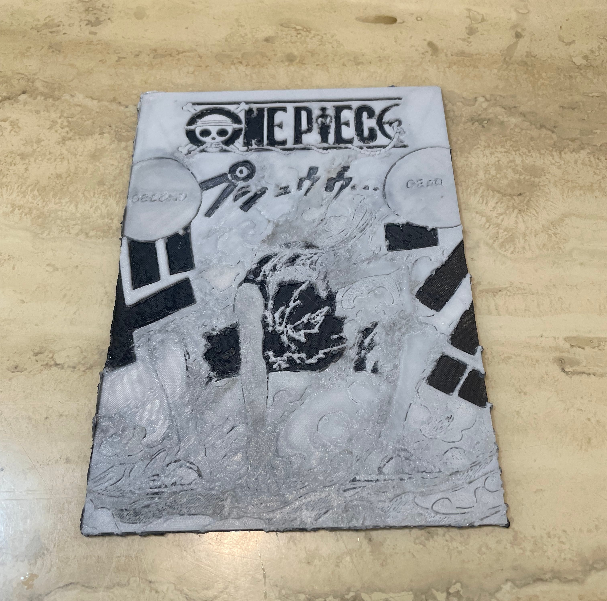

<figcaption>굉장히 멋있다...</figcaption>

돌아다니다가 재미있는걸 찾았는데, 바로 이미지를 3d 형태로 바꿔서 stl로 바꿔주는 프로그램이다. 지피티한테 물어보니까 hueforge를 추천해줬는데 찾아보니까 유료고 꽤 비싸서... 대체 무료 프로그램인 Kromacut을 사용하여 만들었다. 

개인적으로는 단순 이미지보다 위 사진같이 white and black톤의 만화 장면들이 멋있게 나오는 것 같아 원피스의 루피 기어2를 한번 출력해 봤다.

<figcaption>음...</figcaption>

0.2노즐로 출력하였고 필라멘트는 검정 회색 흰색 이렇게 3가지를 사용하였다. 아무래도 멀티헤드가 ams가 없다보니 수동으로 교체해줘야했는데 이걸 위해 직접 매크로까지 추가해서 교체해야했던게 약간 번거롭긴 했다. 

뭐 멋있다고 느껴지는 사람도 있겠지만 자세히 들여다보면 출력 품질 면에서 위에꺼에 비해 떨어지는 걸 볼 수 있다. User guide를 확인해보니 픽셀 사이즈 세팅이랑 3mf로 파일을 export하는걸 따라하지 않았다. 또한 속도를 너무 느리게 출력해서 출력시간이 너무 길어졌다는 것도 약간 아쉬웠다. 다음 작품은 이 점들을 수정해서 더 나은 출력물을 만들어 볼 예정이다.

개인적으로 이거 일반이미지-> 출력 이 굉장히 높은 품질로 나오게 만들 수 있다면 사업화해서 팔아도 잘 팔릴 것 같다. 약간 기념일?에 특별한 선물 느낌으로 하면 좋지 않을까? 그러기 위해선 일단 프린터를 멀티헤드로(Voron? u1?) 바꿔서 수동 필라멘트 변경 안해도 되게 해야 할 것 같긴 하다. 

