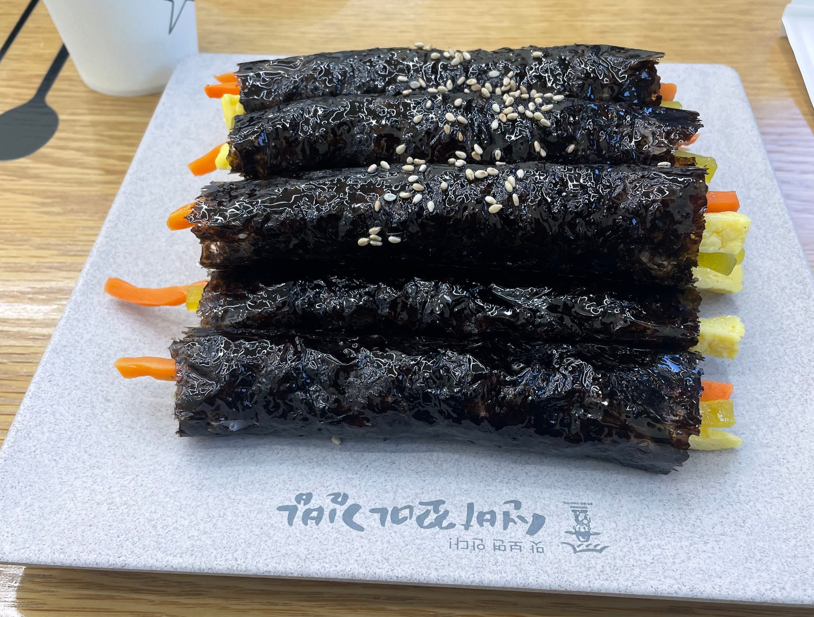
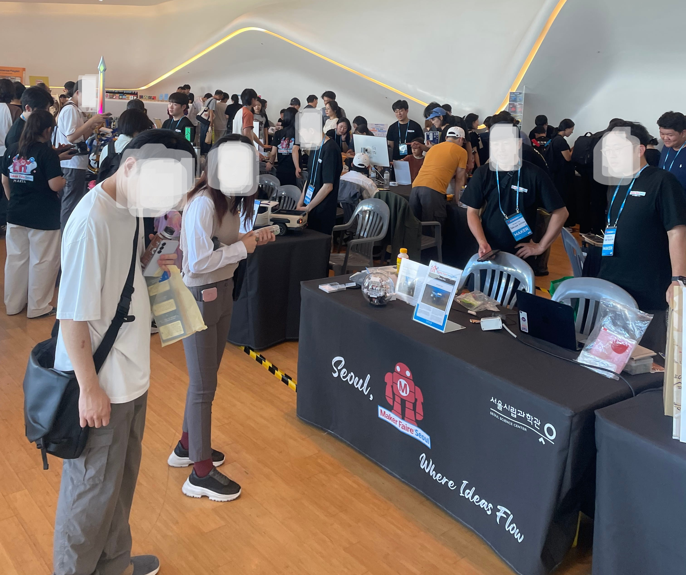
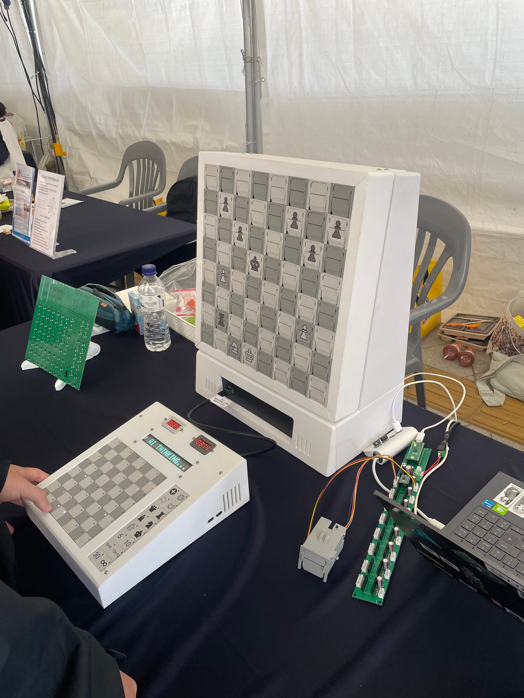
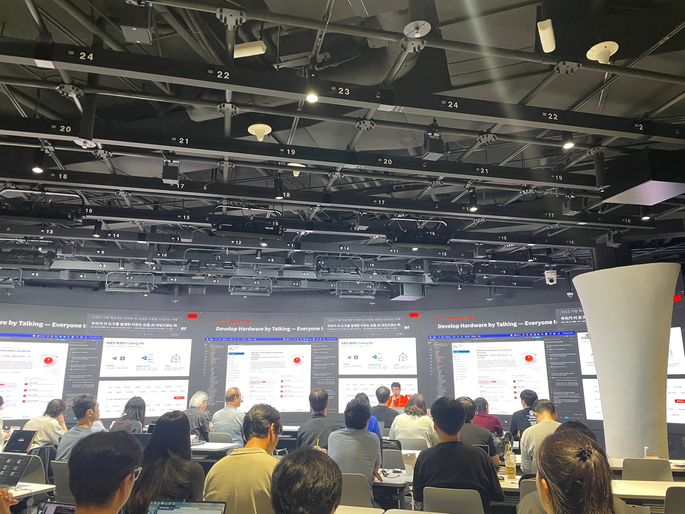
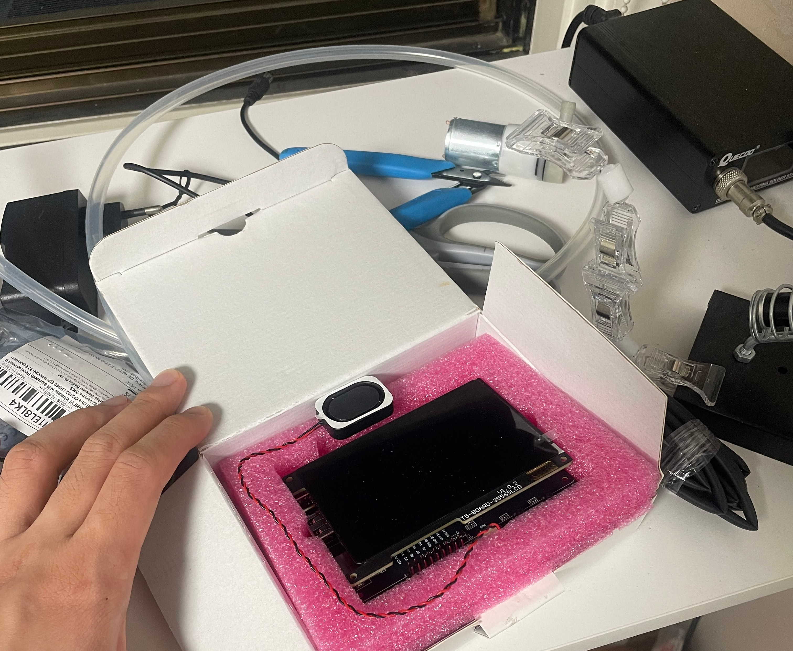
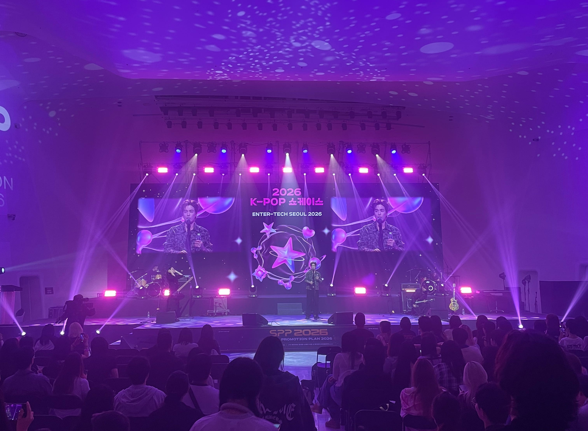
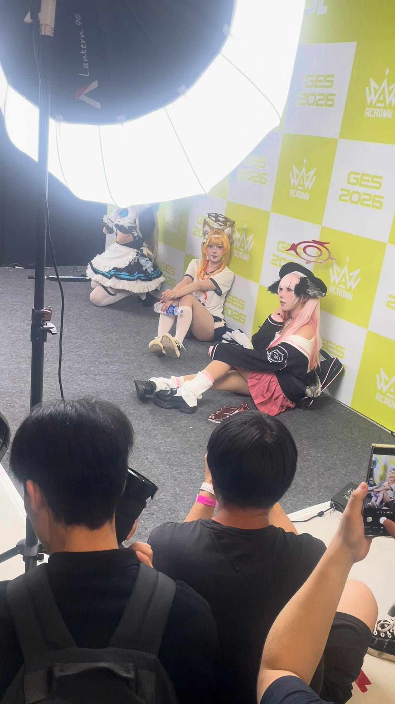
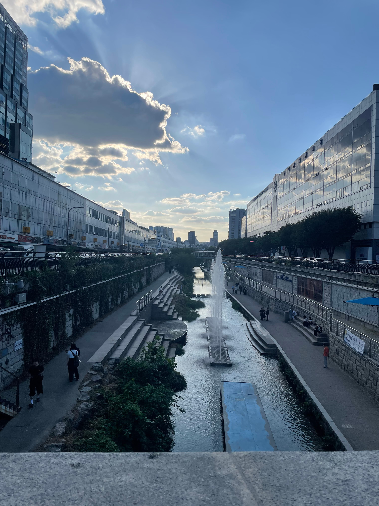

우연히 3d 프린팅 마이너 갤러리에서 어떤사람이 메이커페어에 전시물 출품한다는 글을 봤다. 

좀 찾아보니 행사 자체가 다양한 공학적 제작물들 전시회인 것 같아 재미있어 보여서 가보고 싶었다. 마침 Game e-Sports Seoul 줄여서 ges2026도 뭐 행사 한다고 해서 겸사겸사 이것도 구경하러 갔다! 

<figcaption>점심 때우기 GOD - 김밥</figcaption>

주말 새벽마다 하는 알바 끝나고 좀 쉬다 점심으로 김밥 먹고 DDP로 출발했다. 

내 인생 처음으로 DDP 와봤는데 강동구같은 시골동네에 살아서 그런가 엄청 번화가같이 느껴졌다. 뭐 실제로 번화가이기도 하고. 유동인구가 엄~청 많고 외국인도 많이 있었다. 일단 열시미 Tmap 키고 찾아와서 구경했다. 

인스타나 유튜브에서 많이 본 로봇팔, 3d 프린터 키링도 많았고 역시 Ai의 시대여서 그런가 Ai와 관련된 작품들이 많았다. 

신기한게 많긴 했는데 내가 직접 만들어보고 싶었던 건 따로 없었던 것 같다. 관람객 주 연령층이 어리다보니 뭔가 영감을 일으킬만한 건 없고 다 이미 유행으로 퍼진 것들 만들어서 보여주는 느낌? 이 부분이 약간 아쉬웠다.

<figcaption>AI 체스판</figcaption>

이거 3d 프린터갤에서 보고 구경갔는데 상상이상이었다. 구성도 깔끔하고 되게 유연하게 전환되서 개멋있었다. 이게 출품작들 중에 제일 멋있었고 아이디어도 재미있었던 것 같다. 이런 레트로 감성이 딱 내 취향이다.

좀 지켜보다가 제작자한테 물어보니까 8개월동안 만들었고 100만원 이상 들었다고 한다. 시행착오도 많았다고 들었다. 뭔가 만들어보고 싶긴 했는데 이거 듣고 접기로 했다 ㅋㅋㅋ

<figcaption>tuya ai-agent 제작 설명회</figcaption>

몇몇 기업도 참가했는데, 그중에 내가 사용중인 원격 제어 콘센트의 제작사인 tuya도 있길래 구경갔는데, 어찌저찌 이벤트 참여하려고 물어물어 가보니 tuya ai-agent 제작 실습회에 도달했다. 

근데 뭐 desktop 안들고와서 참여는 못하고 경품만 들고 나왔다. 근데 경품이 ㄹㅇ 혜자인게 LCD랑 스피커 달린 T5 board였다. 일단 집에 esp32도 많긴 한데 스피커랑 LCD가 없어서 한번 사보고 싶긴 했는데 이렇게 5만원 상당의 보드를 공짜로 얻을 줄이야... 쌀먹 네이스

메이커페어는 여기까지 하면 다 즐긴 것 같아 이제 ges2026 구경하러 갔다. 게임 행사인데 나는 요즘 와일드리프트밖에 게임을 안해서... 애초에 마음에 드는 게임이 별로 없을 뿐더러 한번 빠지면 밤새서 하다가 금방 질리기 때문에 그리 게임을 좋아하진 않는다. 

사실 뭐 보려고 온거냐면 요즘 윤가놈 방송을 즐겨 보는데, 댱이님이랑 우결하는 영상을 재미있게 봤고 또 보고 있다. 근데 ges2026이 게임 행사이다보니 코스프레 부스도 있었고, 거기에 댱이님이 코스프레 한다고 해서 방송으로만 보던 사람 한번 실물 보고싶다! 라는 생각에 구경갔다.

<figcaption>개예쁨</figcaption>

와... ㄹㅇ 실물 갑이다. 보통 방송이나 코스프레 하는 사람들은 필터나 보정빨이 많다고 생각했는데 화면이 실물을 담지 못하는 것 같다. 

원래 나는 아이돌이나 이런 방송하는 여자BJ 좋아하는 거 이해하지 못하는 사람이었는데 실물로 보니까 약간 이해가 가는 것 같기도..? ㅋㅋ 

뭔가 내가 즐겨보는 유튜브나 방송하는 사람들 실제로 보는 감회가 새롭다. 저거 위에 체스도 그렇고 인터넷에서 보던거 실제로 보니까 굉장히 기분이 좋다. 그래서 연예인들을 현실에서 그렇게 쫒아다니는건가? 나중에 윤진석도 만나보고, 유튜브에서 강의듣던 경희수학 교수님이나 괴물쥐 이런사람들 보면 되게 재미있을 것 같다.

<figcaption>집으로 돌아가는길에</figcaption>

평소 집에만 틀어있던 나와 다르게 오랜만에? 아니 거의 처음인가? 전시 와본 것 같다. 맨날 골방에 틀어박혀있지만 말고 가끔 이렇게 외출해서 새로운 자극을 받아가는 것도 좋을 것 같다는 생각이 든다. 

삶에 새로운 바람이 불고 있다. 남들이 갔던 길을 이제야 가는건지, 아니면 남들과 다른 관점으로 새로운 길을 걷는건지 모르겠다만 정해지지 않은 미래는 불안과 기대를 동시에 품고 있다. 틀린 관점은 존재하지 않는다. 다만 다른 관점이 존재할 뿐. 